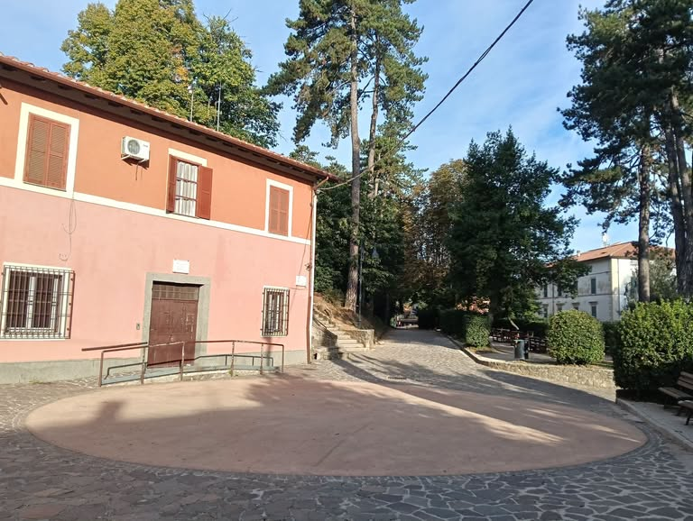

San Vito Romano sorge a circa 650 metri d'altitudine sui Monti Prenestini, a poco più di un'ora da Roma. È uno di quei paesi che si scoprono piano piano: un centro storico raccolto, vicoli stretti che si arrampicano verso il castello, e tutto intorno boschi e sentieri che invitano a uscire dal centro abitato per respirare aria di montagna.

Il cuore del paese si raggiunge a piedi in pochi minuti da qualunque punto ci si trovi. Piazza Santa Maria, il Castello Theodoli, la Chiesa di San Vito: sono tappe che chiunque arrivi qui per la prima volta finisce per percorrere quasi senza accorgersene, lasciandosi guidare dalla pendenza delle strade.

## Un paese verde

Chi vive a San Vito Romano lo sa bene: il verde qui non manca. La Villa Comunale è da sempre il punto d'incontro per eccellenza, il luogo dove generazioni di sanvitesi si sono ritrovate per una passeggiata, una chiacchierata o semplicemente per stare all'aria aperta.

Proprio nel centro del paese, a due passi dalla Villa, si trova anche la Macchiarella, un piccolo bosco che sorprende chi non se lo aspetta così vicino alle case. E basta allontanarsi di pochi minuti in auto per ritrovarsi tra i sentieri dei Monti Prenestini, con panorami che nelle giornate più limpide arrivano a scorgere il mare.

## Una comunità viva

San Vito Romano non è solo pietre e paesaggio: è soprattutto le persone che lo abitano e lo animano. Tra sagre, feste patronali, iniziative del Circolo Culturale e i piccoli gesti quotidiani di chi si prende cura del paese, la vita di comunità qui resta un valore concreto, non solo un ricordo da raccontare.

Questo articolo è il primo di una serie che vuole raccontare San Vito Romano da più punti di vista: la sua storia, i suoi luoghi, le persone che lo vivono ogni giorno. Se vuoi contribuire con un tuo articolo, raccontaci la tua idea nel gruppo Facebook della community.

*Fonte: Redazione SVRLovers.*
